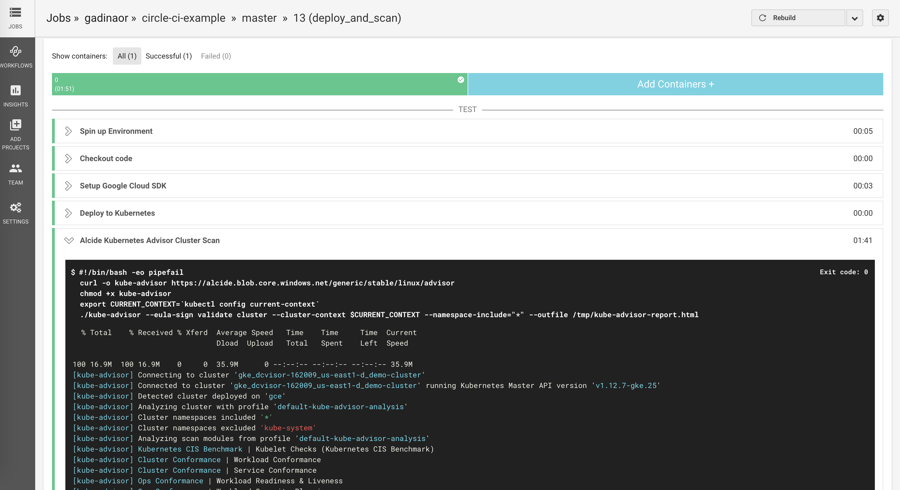

# CircleCI | Security Scanning Kubernetes Cluster & Workloads Hygiene
CircleCI Orb Registry: https://circleci.com/orbs/registry/orb/alcideio/alcide-advisor

Alcide Advisor is an agentless Kubernetes audit, compliance and hygiene scanner that’s built to ensure a friciton free DevSecOps workflows. Alcide Advisor can be plugged early in the development process and before moving to production.

With Alcide Advisor, the security checks you can cover includes:

- Kubernetes infrastructure vulnerability scanning.
- Hunting misplaced secrets, or excessive priviliges for secret access.
- Workload hardening from Pod Security to network policies.
- Istio security configuration and best practices.
- Ingress Controllers for security best practices.
- Kubernetes API server access privileges.
- Kubernetes operators security best practices.
- Deployment conformance to labeling, annotating, resource limits and much more ...

Alcide Advisor security checks are being added and updated on a regular basis.

[VIDEO: Alcide Advisor Overview](https://youtu.be/UXNPMzCtG84)

## CircleCI Integration

#### Prerequisites 

Alcide Kubernetes Advisor runs against a kubernetes cluster and requires access to `kubeconfig`
to authenticate & authorize itself to the cluster.

If your pipeline can run kubectl commands against the cluster successfully - you should be ready to initiate a scan.

To run against GKE, add the variable `GCLOUD_SERVICE_KEY` under *Project Settings* --> *Build Settings* --> *Environment Variables* and paste into the value the content of GCP service account file.




#### *CircleCI* Pipeline Example

```yaml
version: 2
jobs:
  build_and_test:
    docker:
      - image: buildpack-deps:trusty
    environment:
      - FOO: bar
    working_directory: ~/my-app
    steps:
      - checkout
      - run:
          name: Build and Test code repo
          command: |
            echo "Building and Testing"

  deploy_and_scan:
    docker:
      - image: google/cloud-sdk
    environment:
      - PROJECT_NAME: "my-app"
      - GOOGLE_PROJECT_ID: "projid-11111"
      - GOOGLE_COMPUTE_ZONE: "us-east1-d"
      - GOOGLE_CLUSTER_NAME: "demo-cluster"
    steps:
      - checkout
      - run:
          name: Setup Google Cloud SDK
          command: |
            apt-get install -qq -y gettext
            echo $GCLOUD_SERVICE_KEY > ${HOME}/gcloud-service-key.json
            gcloud auth activate-service-account --key-file=${HOME}/gcloud-service-key.json
            gcloud --quiet config set project ${GOOGLE_PROJECT_ID}
            gcloud --quiet config set compute/zone ${GOOGLE_COMPUTE_ZONE}
            gcloud --quiet container clusters get-credentials ${GOOGLE_CLUSTER_NAME}
      - run: 
          name: Deploy to Kubernetes
          command: |
            echo "kubectl apply -f ${HOME}/some_new_resource.yml"
            echo "kubectl rollout status deployment/${PROJECT_NAME}"
      - run: 
          name: Alcide Kubernetes Advisor Cluster Scan
          command: |
            curl -o kube-advisor https://alcide.blob.core.windows.net/generic/stable/linux/advisor
            chmod +x kube-advisor
            export CURRENT_CONTEXT=`kubectl config current-context`
            ./kube-advisor --eula-sign validate cluster --cluster-context $CURRENT_CONTEXT --namespace-include="*" --outfile /tmp/kube-advisor-report.html
      - store_artifacts:
          path: /tmp/kube-advisor-report.html
          destination: alcide-advisor-scan-report.html            
            
workflows:
  version: 2
  build_test_deploy:
    jobs:
      - build_and_test
      - deploy_and_scan:
          requires:
            - build_and_test
          filters:
            branches:
              only: master

        
```

## Feedback and issues

If you have feedback or issues, please email to our [Support](mailto:support@alcide.io)

## Start your risk-free trial now


To get a tailor made exprience with **Alcide Kubernetes Advisor** start your risk-free [trial now](https://www.alcide.io/advisor-free-trial/)

Try all features free for 30 days
100% risk free - no automatic purchase after trial ends

or, [request a demo](https://get.alcide.io/request-demo)
