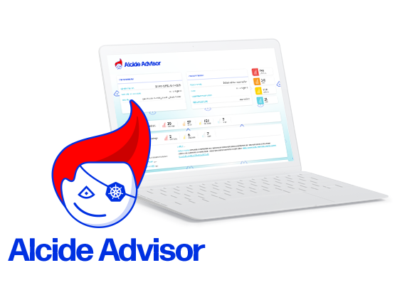
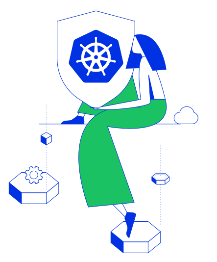
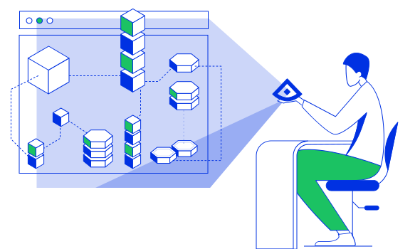

author:            Gadi Naor
summary:           Alcide Kubernetes Advisor
id:                24242
categories:        kubernetes,security
environments:      kubernetes
status:            draft
feedback link:     https://github.com/alcideio/pipeline
analytics account: 0

# Alcide Kubernetes Advisor Overview

## Welcome
Duration: 1:00

In this tutorial we will learn about **Alcide Kubernetes Advisor**, and how we can implement continous security and cluster hygiene for one or more Kubernetes clusters.




Alcide Advisor is an agentless Kubernetes audit, compliance and hygiene scanner that’s built to ensure a friciton free DevSecOps workflows. Alcide Advisor can be plugged early in the development process and before moving to production.

#### With Alcide Advisor, the security checks you can cover includes:

- Kubernetes infrastructure vulnerability scanning.
- Hunting misplaced secrets, or excessive priviliges for secret access.
- Workload hardening from Pod Security to network policies.
- Istio security configuration and best practices.
- Ingress Controllers for security best practices.
- Kubernetes API server access privileges.
- Kubernetes operators security best practices.
- Deployment conformance to labeling, annotating, resource limits and much more ...


## Prerequisites

*If you already have a running kubernetes cluster you can work with you can skip this step*

For this tutorial you will need a Kubernetes cluster with enough permissions to deploy resources into it.

* [Install and Set Up kubectl](https://kubernetes.io/docs/tasks/tools/install-kubectl/).

* [Install Minikube](https://kubernetes.io/docs/tasks/tools/install-minikube/), or any working Kubernetes Cluster


## Prepare Your Environment
Duration: 02:00

[Download Files](tutorial.zip) into **/tmp** and unpack

```sh
cd /tmp &&\
unzip -o tutorial.zip
```

Positive
: Download kube-advisor into **/tmp/training/advisor** or any other location.

#### For Linux
``` sh
cd /tmp/training/advisor &&\
curl -o advisor https://alcide.blob.core.windows.net/generic/stable/linux/advisor &&\
chmod +x advisor
``` 

#### For Mac 
``` sh
cd /tmp/training/advisor &&\
curl -o advisor https://alcide.blob.core.windows.net/generic/stable/darwin/advisor &&\
chmod +x advisor
```




## Full Cluster Scan
Duration: 03:00

We are going to start with an initial cluster scan using the buitin scan profile.


``` bash
cd /tmp/training/advisor &&\
 ./advisor validate cluster --cluster-context minikube \
--namespace-include="*" --namespace-exclude="-" --outfile scan.html
```

Open in your browser the generated report **scan.html** and review the result across the various categories.

``` bash
google-chrome scan.html&   or   open scan.html&
```





## Usecase #1: Secret Hunting
Duration: 06:00

The reality with Kubernetes clusters is that resources can be mutated as a result of variety of events.
For example:

* User making a manual change to the cluster (*kubectl edit ...*)
* Code change, that as part of a deployment pipeline, will end up in a running cluster
* A change in the deployment automation machinery such as Terraform or Ansible

Let's simulate such change ... we are going to add an *AWS Access Key* into a *PodSpec*

Delete nginx deployment from the cluster. 

``` bash
cat <<EOF | kubectl apply -f -
apiVersion: extensions/v1beta1
kind: Deployment
metadata:
  labels:
    run: nginx
  name: nginx
spec:
  replicas: 1
  selector:
    matchLabels:
      run: nginx
  template:
    metadata:
      labels:
        run: nginx
    spec:
      containers:
      - image: nginx
        env:
          - name: "aws_secret"
            value: "AKIAI222221111BBBAAA"
        imagePullPolicy: Always
        name: nginx
        resources: {}
EOF
```

Let's run the scan again and review the findings.

```bash
cd /tmp/training && ./advisor validate cluster --cluster-context minikube --namespace-include="*" --namespace-exclude="-" --outfile scan.html
```

Open in your browser the generated report **scan.html** and look at the **Secret Hunting** section

``` bash
google-chrome scan.html&   or   open scan.html&
```


## Kubernetes Hygiene Drift
Duration: 00:20

Maintaining a certain hygiene level in Kubernetes is challanging.
Doing so continously, is a greater challange, and across multiple cluster that's even harder.

#### Cluster Hygiene Components

* Cluster infrastructure (Control plane, Nodes) hygiene - CVEs, hardenning
* Cluster resource hardening (monitoring, ingress, service...)
* Workloads configuration & hardenning
* Workload software supply chain hygiene


## Creating Cluster Hygiene Baseline
Duration: 03:00

Let's start with establishing a baseline of whatever is currently running in a cluster.
The assumption here is that existing environment satifies our hygiene expectations - but that is not necessarily the reality, which is why reviewing a full cluster scan is critical from best practice perspective.

Negative
: Note **baseline.yaml** now holds our cluster baseline - do not modify this file manually

``` bash
cd /tmp/training/advisor &&\ 
./advisor generate policy-profile --cluster-context minikube --namespace-include="*" --namespace-exclude="-" --outfile baseline.yaml
```


## Usecase #2: Image Registry Whitelisting
Duration: 03:00

Let's introduce a new resource into the cluster, which use an image from an unauthorized location.

``` bash
cat <<EOF | kubectl apply -f -
apiVersion: extensions/v1beta1
kind: Deployment
metadata:
  name: hello-badimage
spec:
  replicas: 1
  selector:
    matchLabels:
      run: hello-badimage
  template:
    metadata:
      labels:
        run: hello-badimage
    spec:
      containers:
      - image: k8s.gcr.io/echoserver:1.10
        imagePullPolicy: IfNotPresent
        name: hello-badimage
        ports:
        - containerPort: 8080
          protocol: TCP
EOF
```

Positive
: Note the baseline we created contains the image registries used at baseline creation time


Let's run the scan again, but now with the generated profile, 
which contains a the list of observed image registries and review the findings.

```bash
cd /tmp/training/advisor && ./advisor validate cluster --cluster-context minikube --namespace-include="*" --namespace-exclude="-" --policy-profile baseline.yaml --outfile scan.html
```

Open in your browser the generated report **scan.html** and look at the **Secret Hunting** section

``` bash
google-chrome scan.html&   or   open scan.html&
```

Positive
: We should now see that the *Workload Software Supply Chain* has a critical exception


## Running The Entire Playbook
Duration: 05:30

#### Open and edit advisor-minikube-demo.sh

Negative
: Set your local editor **DEFAULT_TEXT_EDITOR**

Negative
: Set your local web browser  **WEB_BROWSER**

Negative
: Set you target cluster  **KUBE_CLUSTER**

#### Run the playbook

Positive
: Hit the **Enter** to move from one step to the next one.


```bash
cd /tmp/training/advisor &&\
export  DEFAULT_TEXT_EDITOR=vim &&\
export  WEB_BROWSER=google-chrome &&\
export  KUBE_CLUSTER=minikube &&\
./advisor-minikube-demo.sh
```


## Additional References
Duration: 01:00

### CI+CD Integration samples

See [https://github.com/alcideio/pipeline](https://github.com/alcideio/pipeline)

### GKE Multi-cluster Scan Example

See [gke-advisor-scan.sh](https://raw.githubusercontent.com/alcideio/pipeline/master/scripts/gke-advisor-scan.sh)


