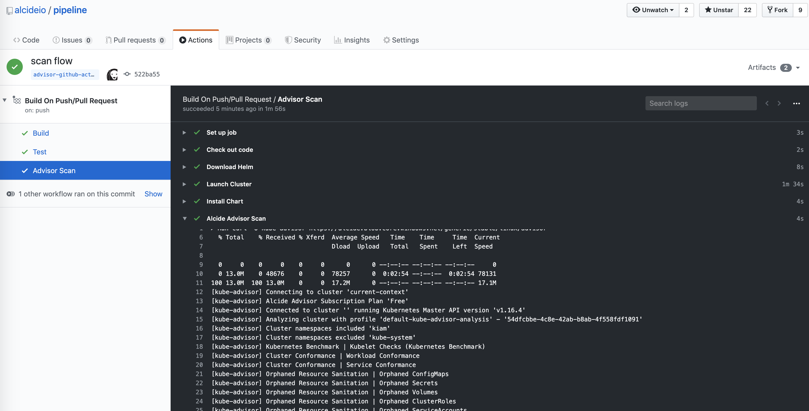

# Github Actions| Security Scanning Kubernetes Cluster & Workloads Hygiene

Alcide Advisor is an agentless Kubernetes audit, compliance and hygiene scanner that’s built to ensure a friciton free DevSecOps workflows. Alcide Advisor can be plugged early in the development process and before moving to production.

With Alcide Advisor, the security checks you can cover includes:

- Kubernetes infrastructure vulnerability scanning.
- Hunting misplaced secrets, or excessive priviliges for secret access.
- Workload hardening from Pod Security to network policies.
- Istio security configuration and best practices.
- Ingress Controllers for security best practices.
- Kubernetes API server access privileges.
- Kubernetes operators security best practices.
- Deployment conformance to labeling, annotating, resource limits and much more ...

Alcide Advisor security checks are being added and updated on a regular basis.

[VIDEO: Alcide Advisor Overview](https://youtu.be/UXNPMzCtG84)

## Github Actions Integration

Alcide Kubernetes Advisor runs against a kubernetes cluster and requires access to `kubeconfig`
to authenticate & authorize itself to the cluster.

If your pipeline can run kubectl commands against the cluster successfully - you should be ready to initiate a scan.

#### *Github Actions* Pipeline Example

The example below shows how to use *Alcide Advisor* pipeline mode to scan a helm chart deployed to a locally created k8s KIND cluster.





```yaml
name: Example Pipeline
on:
  # Trigger the workflow on push or pull request,
  # but only for the master branch
  push:
    branches:
      - '*'
      - '!master'

  pull_request:
    branches:
      - master

jobs:
  build:
    name: Build
    runs-on: ubuntu-latest

    steps:
    - name: Build It (kube-dialer)
      run: |
        mkdir artifacts
        echo 'build stuff' > artifacts/stuff.txt

    - name: Upload Build Artifacts
      uses: actions/upload-artifact@v1
      with:
        name: deployment-files
        path: artifacts/  
  test:
    name: Test
    runs-on: ubuntu-latest
    needs: build   
    steps:
    - name: Check out code
      uses: actions/checkout@v2

    - name: Run chart-testing (lint)
      run: |
        mkdir artifacts
        echo 'build stuff' > artifacts/stuff.txt
        
  advisor-scan:
    name: Advisor Scan 
    runs-on: ubuntu-latest
    needs: test   
    steps:
    - name: Check out code
      uses: actions/checkout@v2

    - name: Download Helm
      run: |
        curl -fsSL -o get_helm.sh https://raw.githubusercontent.com/helm/helm/master/scripts/get-helm-3 
        chmod 700 get_helm.sh 
        ./get_helm.sh


    - name: Launch Cluster
      uses: helm/kind-action@v1.0.0-alpha.3
      with:
        version: v0.7.0
        name: kruzer
        node_image: kindest/node:v1.16.4
        wait: 5m
        install_local_path_provisioner: true

    - name: Install Chart
      run: |
        helm repo add uswitch https://uswitch.github.io/kiam-helm-charts/charts/
        kubectl cluster-info
        kubectl create ns kiam
        helm install  --namespace kiam --wait kiam uswitch/kiam

    - name: Alcide Advisor - Scan Cluster
    uses: alcideio/advisor-action@v1.1.0   
    with:
        include_namespaces: 'kiam'
        output_file: 'advisor-scan.html'

    - name: Upload Alcide Advisor Scan Report
      uses: actions/upload-artifact@v1
      with:
        name: alcide-advisor-security-report.html 
        path: alcide-advisor-security-report.html  


```

## Feedback and issues

If you have feedback or issues, submit a github issue

## Create Free-Forever Account


To unlock your **Alcide Kubernetes Advisor** create your [free-forever account](https://www.alcide.io/pricing#free-forever)

Enjoy all features free for up to 3 nodes, for unlimited time, or [request a demo](https://get.alcide.io/request-demo)
