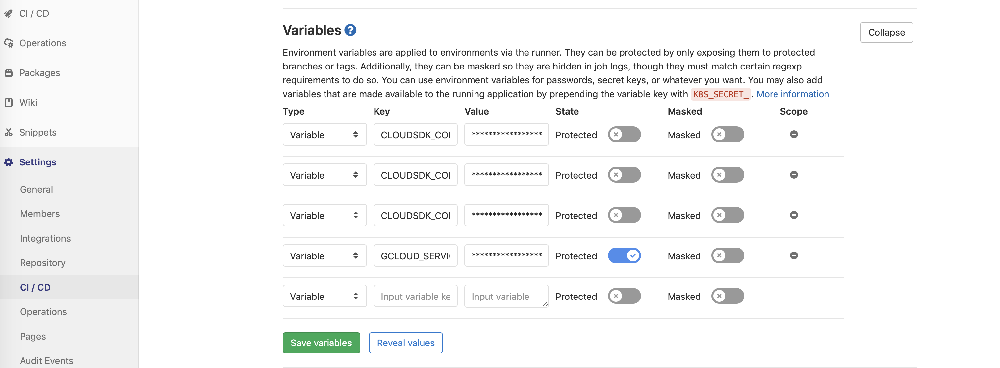
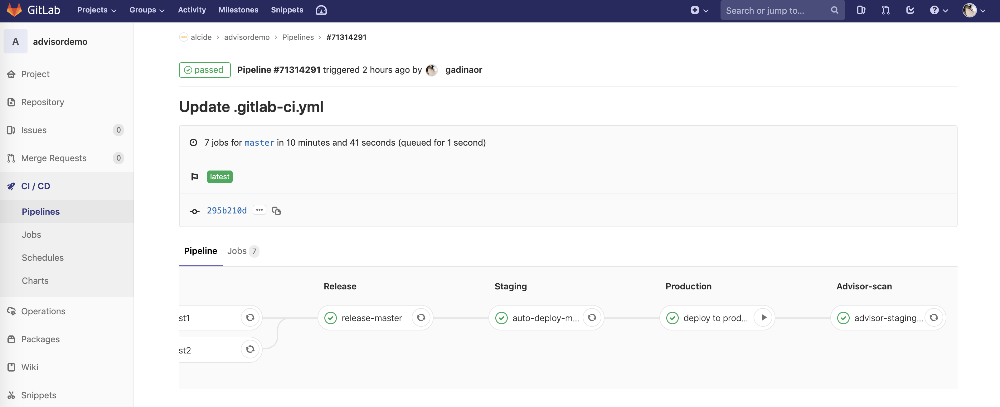

# Gitlab CI | Security Scanning Kubernetes Cluster & Workloads Hygiene

Alcide Advisor is an agentless Kubernetes audit, compliance and hygiene scanner that’s built to ensure a friciton free DevSecOps workflows. Alcide Advisor can be plugged early in the development process and before moving to production.

With Alcide Advisor, the security checks you can cover includes:

- Kubernetes infrastructure vulnerability scanning.
- Hunting misplaced secrets, or excessive priviliges for secret access.
- Workload hardening from Pod Security to network policies.
- Istio security configuration and best practices.
- Ingress Controllers for security best practices.
- Kubernetes API server access privileges.
- Kubernetes operators security best practices.
- Deployment conformance to labeling, annotating, resource limits and much more ...

Alcide Advisor security checks are being added and updated on a regular basis.

[VIDEO: Alcide Advisor Overview](https://youtu.be/UXNPMzCtG84)

## Gitlab CI Integration

#### Prerequisites 

Alcide Kubernetes Advisor runs against a kubernetes cluster and requires access to `kubeconfig`
to authenticate & authorize itself to the cluster.

If your pipeline can run kubectl commands against the cluster successfully - you should be ready to initiate a scan.



To run against GKE, add the variable `GCLOUD_SERVICE_KEY` under *Settings* --> *CI/CD*  expand the *Variables* and paste into the value base64 encoded string of the content of GCP service account file.

Required environment variables for this example:
- GCLOUD_SERVICE_KEY
- CLOUDSDK_CORE_PROJECT
- CLOUDSDK_CONTAINER_CLUSTER
- CLOUDSDK_COMPUTE_ZONE



#### *Gitlab CI* Pipeline Example

```yaml
image: docker:latest
services:
  - docker:dind

stages:
  - build
  - test
  - release
  - staging
  - production
  - advisor-scan


variables:
  DOCKER_DRIVER: overlay

# before_script:
#   - docker login -u gitlab-ci-token -p $CI_BUILD_TOKEN $CI_REGISTRY

build:
  stage: build
  script:
#    - docker build --pull -t $CI_REGISTRY_IMAGE:$CI_BUILD_REF .
#    - docker push $CI_REGISTRY_IMAGE:$CI_BUILD_REF
     - echo "Building ...."
  except:
    - tags

test1:
  image: docker:latest #$CI_REGISTRY_IMAGE:$CI_BUILD_REF
  services: []
  before_script: []
  stage: test
  script:
    - echo "test1"
  except:
    - tags

test2:
  image: docker:latest #$CI_REGISTRY_IMAGE:$CI_BUILD_REF
  services: []
  before_script: []
  stage: test
  script:
    - echo "test2"
  except:
    - tags

#Non-master branches and tags will be released with :<ref_name> as the tag
release-by-name:
  stage: release
  script:
      - echo "release"
    # - docker pull $CI_REGISTRY_IMAGE:$CI_BUILD_REF
    # - docker tag $CI_REGISTRY_IMAGE:$CI_BUILD_REF $CI_REGISTRY_IMAGE:$CI_BUILD_REF_NAME
    # - docker push $CI_REGISTRY_IMAGE:$CI_BUILD_REF
  except:
    - master

#Master will be released with :latest as the tag
release-master:
  stage: release
  script:
      - echo "release master"
    # - docker pull $CI_REGISTRY_IMAGE:$CI_BUILD_REF
    # - docker tag $CI_REGISTRY_IMAGE:$CI_BUILD_REF $CI_REGISTRY_IMAGE:latest
    # - docker push $CI_REGISTRY_IMAGE:latest
  only:
    - master

# Depends on CLOUDSDK_CORE_PROJECT, CLOUDSDK_CONTAINER_CLUSTER, and CLOUDSDK_COMPUTE_ZONE being set
.gcloud: &gcloud
  - echo $GCLOUD_SERVICE_KEY | base64 --decode -i > ~/gcloud-service-key.json
  - gcloud auth activate-service-account --key-file ~/gcloud-service-key.json
  - gcloud --quiet container clusters get-credentials $CLOUDSDK_CONTAINER_CLUSTER

.prod_deploy: &prod_deploy
  image: google/cloud-sdk
  stage: production
  #environment: demo-cluster
  before_script: *gcloud
  script:
     - echo "deploying into kubernetes"
     
    #- kubectl patch deployment $PRODUCTION_SERVICE_NAME -p '{"spec":{"template":{"spec":{"containers":[{"name":"'"$PRODUCTION_SERVICE_NAME"'","image":"'"$CI_REGISTRY_IMAGE:$CI_BUILD_REF"'"}]}}}}'

.staging_deploy: &staging_deploy
  image: google/cloud-sdk
  stage: staging
  #environment: demo-cluster
  before_script: *gcloud
  script:
    - echo "Deploy to staging" ${CLOUDSDK_CONTAINER_CLUSTER}
    #- kubectl patch deployment $STAGING_SERVICE_NAME -p '{"spec":{"template":{"spec":{"containers":[{"name":"'"$STAGING_SERVICE_NAME"'","image":"'"$CI_REGISTRY_IMAGE:$CI_BUILD_REF"'"}]}}}}'

auto-deploy-master:
  <<: *staging_deploy
  only:
    - master

auto-deploy-tags:
  <<: *prod_deploy
  only:
    - tags

deploy to staging:
  <<: *staging_deploy
  when: manual
  except:
    - master
    - tags

deploy to production:
  <<: *prod_deploy
  when: manual
  only:
    - master

.advisor-scan: &advisor-scan
    - echo "Scanning Kubernetes Cluster" ${CLOUDSDK_CONTAINER_CLUSTER}
    - curl -o kube-advisor https://alcide.blob.core.windows.net/generic/stable/linux/advisor
    - chmod +x kube-advisor
    - export CURRENT_CONTEXT=`kubectl config current-context`
    - ./kube-advisor --eula-sign validate cluster --cluster-context $CURRENT_CONTEXT --namespace-include="*" --outfile alcide-advisor-report.html
    - echo "Publish report"

advisor-staging-scan:
  image: google/cloud-sdk
  stage: advisor-scan
  before_script: *gcloud
  script: *advisor-scan
  artifacts:
    paths:
    - alcide-advisor-report.html
    #expire_in: 1 week


```

## Feedback and issues

If you have feedback or issues, submit a github issue

## Create Free-Forever Account


To unlock your **Alcide Kubernetes Advisor** create your [free-forever account](https://www.alcide.io/pricing#free-forever)

Enjoy all features free for up to 3 nodes, for unlimited time, or [request a demo](https://get.alcide.io/request-demo)
