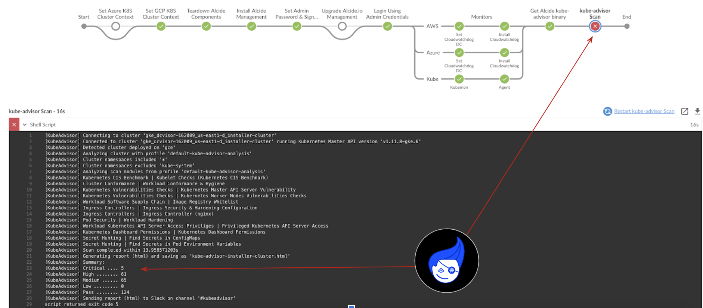

# Jenkins | Security Scanning Kubernetes Cluster & Workloads Hygiene

Alcide Advisor is an agentless Kubernetes audit, compliance and hygiene scanner that’s built to ensure a friction free DevSecOps workflows. Alcide Advisor can be plugged early in the development process and before moving to production.

With Alcide Advisor, the security checks you can cover includes:

- Kubernetes infrastructure vulnerability scanning.
- Hunting misplaced secrets, or excessive priviliges for secret access.
- Workload hardening from Pod Security to network policies.
- Istio security configuration and best practices.
- Ingress Controllers for security best practices.
- Kubernetes API server access privileges.
- Kubernetes operators security best practices.
- Deployment conformance to labeling, annotating, resource limits and much more ...

Alcide Advisor security checks are being added and updated on a regular basis.

[VIDEO: Alcide Advisor Overview](https://youtu.be/UXNPMzCtG84)

## Jenkins Integration

#### Prerequisites 

Alcide Kubernetes Advisor runs against a kubernetes cluster and requires access to `kubeconfig`
to authenticate & authorize itself to the cluster.

If your pipeline can run kubectl commands against the cluster successfully - you should be ready to initiate a scan.



#### *Jenkinsfile* Sample Pipeline Steps

```Jenkinsfile
import jenkins.model.*
import hudson.AbortException

pipeline {
    agent any
    environment {
    }

    stages {
        stage('Build + Test') {
            steps {
                echo "Build + Test your code"
            }
        }
        stage('Deploy') {
            steps {
                script {
                    if (currentBuild.result == 'SUCCESS')
                        echo 'Deploying....'
                    else
                        echo 'Deployment skipped'
                }
            }
        }
        //Obtain the scanner
        stage('Get Alcide kube-advisor binary') {
            steps {
                dir("kube-advisor") {
                    sh "curl -o kube-advisor https://alcide.blob.core.windows.net/generic/stable/linux/advisor"
                    sh "chmod +x kube-advisor"
                }
            }
        }
        //Obtain the scanner
        stage('kube-advisor Scan'){
            steps{
                dir("kube-advisor") {
                    sh """#!/bin/bash
                    CURRENT_CONTEXT=`kubectl config current-context`
                    ./kube-advisor --eula-sign validate cluster --cluster-context \$CURRENT_CONTEXT --namespace-include="*" --outfile kube-advisor-report.html
                """

                    // Archive the built artifacts
                    archive includes: "kube-advisor-report.html"

                    // publish html
                    publishHTML target: [
                            allowMissing: false,
                            alwaysLinkToLastBuild: false,
                            keepAll: true,
                            reportDir: ".",
                            reportFiles: "kube-advisor-report.html",
                            reportName: "Kubeadvisor-Report"
                    ]
                }
            }
        }        
    }
}

        
```

## Feedback and issues

If you have feedback or issues, please email to our [Support](mailto:support@alcide.io)

## Start your risk-free trial now


To get a tailor made exprience with **Alcide Kubernetes Advisor** start your risk-free [trial now](https://www.alcide.io/advisor-free-trial/)

Try all features free for 30 days
100% risk free - no automatic purchase after trial ends

or, [request a demo](https://get.alcide.io/request-demo)
