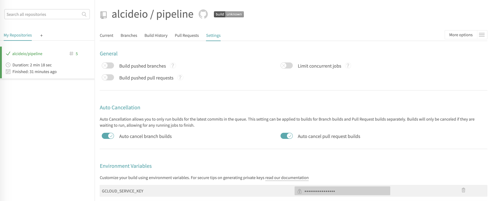
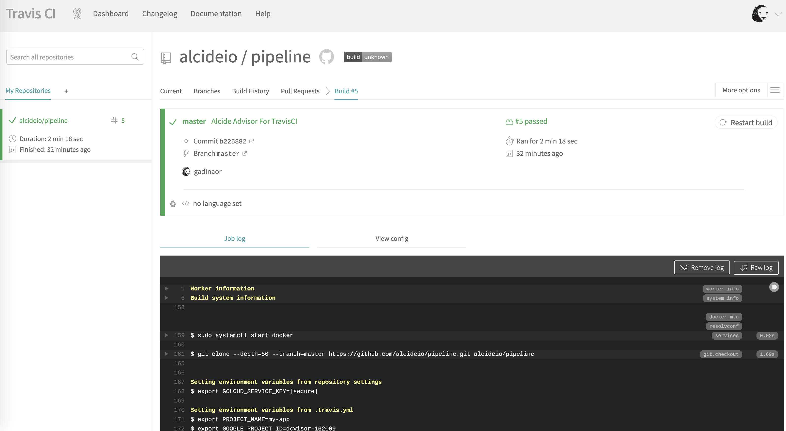

# Travis CI | Security Scanning Kubernetes Cluster & Workloads Hygiene

Alcide Advisor is an agentless Kubernetes audit, compliance and hygiene scanner that’s built to ensure a friciton free DevSecOps workflows. Alcide Advisor can be plugged early in the development process and before moving to production.

With Alcide Advisor, the security checks you can cover includes:

- Kubernetes infrastructure vulnerability scanning.
- Hunting misplaced secrets, or excessive priviliges for secret access.
- Workload hardening from Pod Security to network policies.
- Istio security configuration and best practices.
- Ingress Controllers for security best practices.
- Kubernetes API server access privileges.
- Kubernetes operators security best practices.
- Deployment conformance to labeling, annotating, resource limits and much more ...

Alcide Advisor security checks are being added and updated on a regular basis.

[VIDEO: Alcide Advisor Overview](https://youtu.be/UXNPMzCtG84)

## Travis CI Integration

#### Prerequisites 

Alcide Kubernetes Advisor runs against a kubernetes cluster and requires access to `kubeconfig`
to authenticate & authorize itself to the cluster.

If your pipeline can run kubectl commands against the cluster successfully - you should be ready to initiate a scan.



To run against GKE, add the variable `GCLOUD_SERVICE_KEY` under *My Repositories* --> *YourRepo* Choose the *More options* --> *Settings* and paste into the value (don't forget to place it with '') the content of GCP service account file.



#### *Travis CI* Pipeline Example

```yaml
dist: xenial 
sudo: required
language: generic
services:
- docker
cache:
  directories:
  - $HOME/google-cloud-sdk
env:
  global:
  - PROJECT_NAME: "my-app"
  - GOOGLE_PROJECT_ID: "myproj-111111"
  - GOOGLE_COMPUTE_ZONE: "us-east1-d"
  - GOOGLE_CLUSTER_NAME: "demo-cluster"
  - CLOUDSDK_CORE_DISABLE_PROMPTS=1
before_install:
#Install Google Cloud SDK if needed
- if [ ! -d $HOME/google-cloud-sdk/bin ]; then
      rm -rf $HOME/google-cloud-sdk;
      curl https://sdk.cloud.google.com | bash;
  fi
- source $HOME/google-cloud-sdk/path.bash.inc

#Install kubectl and helm to deploy resources/charts
- gcloud components update kubectl
#- curl -s https://storage.googleapis.com/kubernetes-helm/helm-v2.12.1-linux-amd64.tar.gz | sudo tar -C /usr/local/bin --strip-components 1 -zvxpf -

- gcloud version
# Wire the servic account and authenticate
- echo $GCLOUD_SERVICE_KEY > $HOME/gcloud-service-key.json
- gcloud auth activate-service-account --key-file $HOME/gcloud-service-key.json

# Get the cluster credentials
- gcloud --quiet config set project ${GOOGLE_PROJECT_ID}
- gcloud --quiet config set compute/zone ${GOOGLE_COMPUTE_ZONE}
- gcloud --quiet container clusters get-credentials ${GOOGLE_CLUSTER_NAME}
- echo "Deploying resource to Kubernetes ${GOOGLE_CLUSTER_NAME}"
- echo "Scanning Kubernetes Cluster ${GOOGLE_CLUSTER_NAME}"
- curl -o kube-advisor https://alcide.blob.core.windows.net/generic/stable/linux/advisor
- chmod +x kube-advisor
- export CURRENT_CONTEXT=`kubectl config current-context`
- ./kube-advisor --eula-sign validate cluster --cluster-context $CURRENT_CONTEXT --namespace-include="*" --outfile /tmp/kube-advisor-report.html
- echo "Publish report"

```

## Feedback and issues

If you have feedback or issues, please email to our [Support](mailto:support@alcide.io)

## Start your risk-free trial now


To get a tailor made exprience with **Alcide Kubernetes Advisor** start your risk-free [trial now](https://www.alcide.io/advisor-free-trial/)

Try all features free for 30 days
100% risk free - no automatic purchase after trial ends

or, [request a demo](https://get.alcide.io/request-demo)
